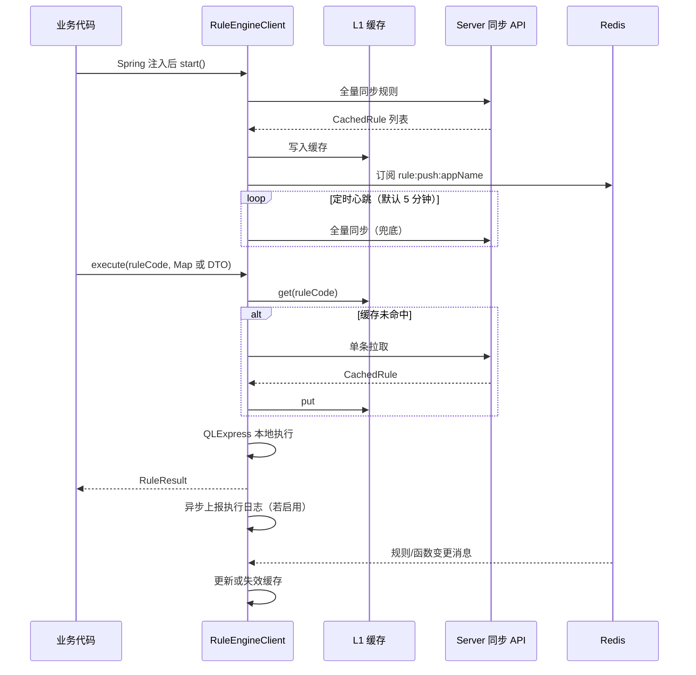
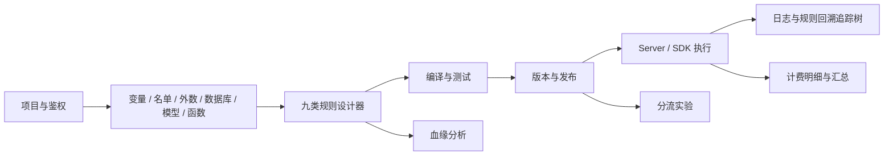
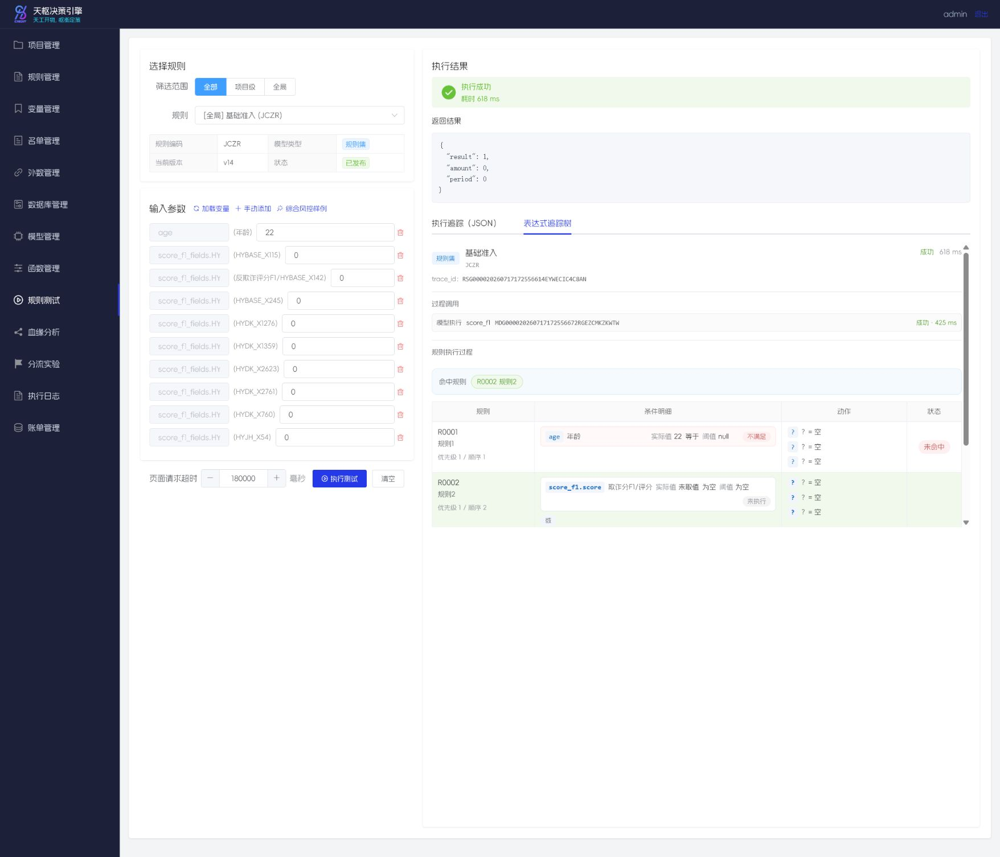

<p align="center">
  
</p>

<h3 align="center">

🔍 鉴真伪 · 📊 斟信用 · ⚖️ 衡风险 · 🎯 枢定策

</h3>


# 天枢决策引擎

> 天工开物，枢衡定策（Creating Possibilities. Calibrating Decisions）

> **重要提示**: 当前为预发布版，功能待增加，有部分功能逻辑还在修缮中 ......


天枢决策引擎是一套基于 Spring Boot 2.3、QLExpress 4、Vue 2 和 Element UI 的可视化风控决策平台。系统面向业务人员提供规则项目、变量、名单、外数 API、外部数据库、模型、函数、规则测试、血缘分析、分流实验、执行日志和账单管理等能力；面向业务系统提供 `rule-engine-client` SDK，用于拉取、缓存并执行已发布规则。

当前功能、系统设计、代码实现、UI、模块关联和验证结论见[《天枢决策引擎当前实现研究报告》](docs/research/2026-07-17-tianshu-decision-engine-current-state.md)。


## 交流

|  微信 |  微信公众号 |
| :---: | :----: |
|  |  |
|  itlubber  | hengshucredit-com |

## 1. 功能总览

| 模块 | 主要能力 |
|------|----------|
| 项目管理 | 管理规则项目、访问令牌和项目级接口说明 |
| 规则管理 | 新建、设计、编译、发布、下线和版本回滚规则 |
| 变量管理 | 管理输入、计算、常量、API、数据库、名单等变量；API/DB/名单变量支持在线测试和取数详情 |
| 名单管理 | 维护名单库、名单记录、导入导出和名单匹配日志 |
| 外数管理 | 配置外部 API 数据源、接口请求映射、响应映射、鉴权和调用日志 |
| 数据库管理 | 配置外部数据库连接池、测试连接、只读查询和数据库调用日志 |
| 模型管理 | 管理模型入参、出参、执行测试和模型调用日志 |
| 函数管理 | 管理 QLExpress 脚本、Java 类、Spring Bean 等函数 |
| 规则测试 | 按项目和规则加载输入字段，执行测试并查看追踪结果 |
| 血缘分析 | 从项目、变量、规则、模型、API、DB、名单等节点查看上下游依赖图 |
| 分流实验 | 配置冠军/挑战/测试组，按条件或流量执行实验 |
| 执行日志 | 查看服务端和客户端规则执行记录、耗时、结果和追踪树 |
| 账单管理 | 配置计费项、查看明细记录和聚合汇总 |

## 2. 模块结构

| 模块 | 说明 | 默认端口 |
|------|------|----------|
| `rule-engine-model` | 公共实体、DTO 和数据库映射模型 | - |
| `rule-engine-core` | 规则编译器和 QLExpress 执行核心 | - |
| `rule-engine-server` | 管理端 REST API、同步接口、日志、外数和数据库服务 | 8080 |
| `rule-engine-client` | 业务系统 SDK，负责规则同步、L1 缓存和本地执行 | - |
| `rule-engine-example` | SDK 集成示例服务 | 7070 |
| `rule-engine-builder-ui` | Vue 2 控制台，独立构建和部署 | 9090 |
| `rule-engine-mysql` | MySQL 配置与初始化脚本 | 3306 |
| `rule-engine-redis` | Redis Pub/Sub 配置 | 6379 |

后端 Java 包名前缀统一为 `com.hengshucredit.rule.*`，数据库表名、Redis 频道和前端 API 路由保持业务语义不变。

## 3. 架构与运行链路



要点：

- 前后端分离部署，`rule-engine-builder-ui` 的构建产物在 `dist/`，不混入 `rule-engine-server`。
- 业务系统不直连 MySQL 获取规则，通过 SDK 调用服务端同步接口。
- Redis 需要与 `rule-engine-server` 使用同一实例。规则发布、下线、函数变更会向 `rule:push:{appName}` 推送消息。
- 执行日志默认 HTTP 上报；classpath 中存在 `KafkaTemplate` Bean 时可切换到 Kafka。

各业务功能通过变量引用、编译产物、发布版本和执行追踪形成完整链路：



## 4. 环境要求

- JDK 8
- Maven 3.6+
- MySQL 8
- Redis
- Node.js 14+，建议 22.14.x
- 可选 NVIDIA GPU：默认构建使用可移植的 ONNX Runtime CPU 包，不要求 NVIDIA 驱动、CUDA 或 cuDNN；只有使用 `-Ponnx-gpu` 构建 CUDA 版后端时，才需安装与项目 ONNX Runtime GPU 版本兼容的 NVIDIA 驱动、CUDA 和 cuDNN，并确保其动态库在服务进程的 `PATH`/`LD_LIBRARY_PATH` 中。

## 5. 本地启动

### 5.1 数据库与基础设施

```bash
docker compose up -d
```

`schema.sql` 只包含数据库、表和索引等结构 DDL；`export_202607161151.sql` 是当前唯一的初始数据快照。空 Docker 数据卷首次启动时会依次执行 `01-schema.sql` 和 `02-export.sql`。根编排中的 `mysql-init` 对已有数据卷只重复执行结构 DDL，不会自动重放会覆盖业务数据的 export。项目鉴权、临时 Token 及其访问审计数据与部署主密钥绑定，不写入初始快照；服务启动后会把项目表中的兼容访问令牌按当前主密钥迁移为默认鉴权记录。

需要手工完整恢复时，固定顺序为：删除 `rule_engine` 数据库，执行 `schema.sql`，再执行 `export_202607161151.sql`。export 会清空并重建其覆盖的全部数据表，因此不得直接用于需要保留现有业务数据的数据库。

### 5.2 后端

```bash
mvn clean install -DskipTests
cd rule-engine-server
mvn spring-boot:run
```

以上命令构建并启动 CPU 版，适用于没有 NVIDIA GPU/CUDA 的机器。需要 CUDA 推理时，构建和启动必须使用同一个 Maven Profile：

```bash
mvn clean install -Ponnx-gpu -DskipTests
cd rule-engine-server
mvn spring-boot:run -Ponnx-gpu
```

默认配置读取：

- MySQL: `jdbc:mysql://localhost:3306/rule_engine`
- 用户名: `root`
- 密码: `1qaz@WSX`
- Redis: `localhost:6379`

控制台登录默认启用，账号密码：

- 用户名: `admin`
- 密码: `1qaz@WSX`

可通过环境变量 `CONSOLE_USERNAME`、`CONSOLE_PASSWORD` 覆盖。

ONNX 神经网络模型可在“模型管理”中逐个选择 CPU 或 CUDA，并配置 GPU 设备号、显存上限、显存扩展策略、cuDNN 卷积算法搜索和默认 CUDA 流。CPU 版后端即使读取到历史 CUDA 配置也会自动回退 CPU，不影响服务启动；CUDA 版后端会实际检查 CUDA 共享库及其依赖是否可加载。服务按“模型文件内容 + 运行配置”缓存推理会话；开启“启动预加载”后会在服务启动阶段创建对应 CPU/CUDA 会话。配置 CUDA 的模型在 GPU 会话初始化或推理失败时会自动重试 CPU，CPU 成功后同一服务进程内后续调用会直接使用 CPU；修复 GPU 环境后需重启服务以重新尝试 CUDA。YuNet 人脸检测同样通过 ONNX Runtime 执行，OpenCV 仅保留图片解码、缩放和检测结果后处理。

### 5.3 前端

```bash
cd rule-engine-builder-ui
npm install
npm run dev
```

开发访问地址为 `http://localhost:9090/`，`/api` 会代理到 `http://localhost:8080`。

## 6. 核心模型类型

| 模型类型 | 设计器路由 | 说明 |
|----------|------------|------|
| 决策表 | `#/designer/table/{definitionId}` | 条件树加动作列，支持 FIRST、ALL、UNIQUE 命中策略 |
| 决策树 | `#/designer/tree/{definitionId}` | 节点、连线条件和任务动作编排 |
| 决策流 | `#/designer/flow/{definitionId}` | 流程节点、网关、连线和任务动作编排 |
| 规则集 | `#/designer/ruleset/{definitionId}` | 多规则顺序编排，可组合条件、动作和命中策略 |
| 交叉表 | `#/designer/cross/{definitionId}` | 行变量、列变量和二维矩阵结果 |
| 评分卡 | `#/designer/score/{definitionId}` | 评分项、权重、分数等级和结果变量 |
| 复杂交叉表 | `#/designer/cross-adv/{definitionId}` | 多行维度、多列维度和矩阵结果 |
| 复杂评分卡 | `#/designer/score-adv/{definitionId}` | 维度组、维度规则、权重和等级 |
| QL 脚本 | `#/designer/script/{definitionId}` | 直接编辑 QLExpress 脚本并维护脚本变量引用 |

各设计器的“测试”入口会按当前模型引用生成测试样例。决策表、规则集、树、流、交叉表、评分卡、复杂模型和脚本会优先使用规则实际输入字段，不把结果变量作为默认入参。

设计器测试弹窗统一使用 Monaco JSON 编辑器。点击“测试”后会自动生成当前规则输入字段样例；点击“执行”后在同一弹窗内展示本次输入、执行输出和错误信息，便于对照排查。

## 7. 当前功能截图

### 7.1 登录


### 7.2 项目管理


### 7.3 项目详情与规则列表


### 7.4 变量管理

变量管理支持项目级和全局变量。变量来源包括输入、计算、常量、API、数据库和名单。API、数据库、名单来源变量可在列表操作中点击“测试”，输入上下文 JSON 后直接触发对应外部取数或匹配逻辑，并写入对应模块调用日志。

API、数据库、名单来源变量额外提供“详情”入口，可查看该变量依赖的引擎输入字段、参数映射或查询字段，以及原始 `sourceConfig` JSON。


### 7.5 名单管理


### 7.6 外数管理

外数管理用于统一配置外部 API 数据源、接口、鉴权、请求映射、响应映射、超时、重试、缓存和计费项。

请求头、Query、入参映射和响应映射支持业务表单与 JSON 双向配置；动态时间戳、签名、加解密、Token 解包及多结构响应可通过请求/响应 QL 脚本处理。脚本变量支持敏感值脱敏，请求与响应脚本可通过仅本次调用有效的 `state` 共享临时值，接口地址支持 `${appId}`、`${vars.appId}`、`${input.channel}` 等占位符。

`rule-engine-server/src/main/resources/sql/data-third-party-api.sql` 提供 15 个第三方数据源、17 个 API 的可重复导入模板，覆盖多种 Token、MD5/SM3/HMAC、3DES/RSA、动态 Header、Form/JSON 请求和响应解包场景。模板凭据均为 `REPLACE_BEFORE_ENABLE_*` 占位符并默认停用；可在“接口测试”中使用“生成请求预览”验证完整构造链路，预览不会访问外部地址。


### 7.7 数据库管理

数据库管理用于维护后端集中连接池。数据库变量执行时通过后端查询外部数据库，不由前端或客户端直连数据库。

数据源校验 SQL、数据库变量 SQL 和数据库测试 SQL 均使用 Monaco SQL 编辑器，支持 SQL 关键字高亮，便于维护较长查询语句。


数据库日志按数据库语义记录连接方式、查询状态、开始结束时间、SQL、参数字段和值、返回结果表内容，以及解析后提取的变量字段和值。


### 7.8 模型管理


### 7.9 函数管理


### 7.10 规则测试

规则测试会读取规则输入字段，并可从规则内容兜底提取测试入参。页面执行后可查看结果、入参和追踪树。


规则回溯追踪树按层级展示规则状态、耗时、输入输出、条件命中、动作结果、嵌套规则和模型/函数等模块调用，便于还原一次决策的完整执行路径。



### 7.11 血缘分析

血缘分析支持从项目、变量、规则、模型、API、数据库、名单和外数源出发，查看上游依赖、下游引用或全量关系。不同类型节点用不同颜色展示。


### 7.12 分流实验

分流实验支持配置冠军组、挑战组和测试组。冠军组和挑战组参与生产分流；测试组可在生产组执行后空跑，用于验证新规则结果。配置页支持按条件命中、流量比例、互斥执行、测试组是否调用 API 外数等策略，执行后会记录实验标签和明细。


### 7.13 执行日志

执行日志展示规则输入、输出、耗时、来源和表达式追踪。详情页提供各类规则执行回溯：决策表/规则集命中路径、树和流节点执行、交叉表/评分卡命中项、复杂模型维度命中、QL 脚本赋值与条件判断等。


### 7.14 账单管理


## 8. 设计器截图

### 8.1 决策表


### 8.2 决策树


### 8.3 决策流


### 8.4 交叉表


### 8.5 评分卡


### 8.6 复杂交叉表


### 8.7 复杂评分卡


### 8.8 QL 脚本


## 9. 业务系统 SDK 集成

业务系统引入 `rule-engine-client` 后，可继续使用项目原有访问令牌，也可按项目配置账号密码、API Key 或 HMAC-SHA256。非旧令牌方式默认先调用 `/api/rule/auth/token` 换取短期 Bearer Token，再同步或执行规则；调用方不需要也不能传 `authCode`，服务端会根据凭证自动识别鉴权配置。

```yaml
rule-engine:
  client:
    server-url: http://localhost:8080
    app-name: your-service-name
    project-code: your-project-code
    token: <项目访问令牌>
    project-id: 1
    trace-enabled: true
    # 规则依赖 API/DB/名单变量时必须开启服务端执行
    server-side-execution: true
```

账号密码方式示例（默认 Token 有效期 2 小时、失效后宽限 10 分钟，均可在项目鉴权配置中调整）：

```yaml
rule-engine:
  client:
    server-url: http://localhost:8080
    app-name: your-service-name
    project-code: your-project-code
    auth-type: BASIC
    username: caller-account
    password: caller-password
    token-exchange-enabled: true
    token-refresh-ahead-seconds: 60
```

API Key 使用 `auth-type: API_KEY` 并配置 `api-key`、`api-key-placement`（`HEADER` 或 `QUERY`）和 `api-key-parameter-name`；HMAC 使用 `auth-type: HMAC_SHA256` 并配置 `access-key` 与 `hmac-secret`。Java Builder 分别提供 `basicAuth(...)`、`apiKeyAuth(...)` 和 `hmacAuth(...)`。

HMAC 请求固定携带 `X-Rule-Access-Key`、`X-Rule-Timestamp`、`X-Rule-Nonce` 和 `X-Rule-Signature`。签名值为以下标准串使用 HMAC-SHA256 计算后的小写十六进制结果；Query 使用原始编码串，请求体使用原始字节：

```text
HTTP_METHOD\n
REQUEST_URI\n
RAW_QUERY\n
SHA256_HEX(REQUEST_BODY)\n
UNIX_TIMESTAMP_SECONDS\n
NONCE
```

直接调用 `/token` 时，只提交当前鉴权方式的凭证。例如账号密码使用 HTTP Basic：

```bash
curl -X POST http://localhost:8080/api/rule/auth/token \
  -H "Authorization: Basic <base64(username:password)>"

curl -X POST http://localhost:8080/api/rule/sync/execute/RC_PRICING_TABLE \
  -H "Authorization: Bearer <accessToken>" \
  -H "Content-Type: application/json" \
  -d '{"clientAppName":"your-service-name","params":{}}'
```

执行示例：

```java
RuleResult result = ruleEngineClient.execute("RC_PRICING_TABLE", requestMap);
```

SDK 行为：

- 启动时全量同步规则到 L1 缓存。
- 订阅 Redis 推送，规则发布或下线后刷新本地缓存。
- 缓存未命中时可按规则编码单条拉取。
- 默认本地使用 QLExpress 执行脚本，适合只依赖入参、常量、计算变量和已同步函数的规则。
- 如果规则依赖 API 变量、数据库变量或名单变量，必须开启 `server-side-execution: true`，或直接调用服务端接口 `POST /api/rule/sync/execute/{ruleCode}`。这些外部变量只在服务端通过 `VariableSourceResolver` 解析，本地 SDK 不会直连外部 API、数据库或名单库。
- SDK 在 Token 到期前 60 秒自动续期；续期失败时继续使用旧 Token，直到其宽限期结束。
- Spring Boot 自动配置使用任一项目鉴权方式（包括原项目令牌）时，执行日志固定通过受鉴权的 HTTP 接口上报，由服务端写入可信的鉴权及 Token 归因；未配置项目鉴权时才保留外部日志上报器选择。
- 可异步上报执行日志。

项目鉴权配置、长期凭证和短期 Token 均可在控制台再次查看完整值。长期凭证在数据库中使用 AES-GCM 可逆加密存储；启动服务前必须通过 `RULE_AUTH_MASTER_KEY` 配置至少 32 位的独立主密钥并妥善保管，未配置或使用公开开发密钥时服务会拒绝启动。新密文默认使用 `v2` 密钥；升级前若已有旧 `v1` 密文，还需通过 `RULE_AUTH_LEGACY_MASTER_KEY` 保留原主密钥，待旧凭证全部修改或重置后才能移除。可通过 `RULE_AUTH_ACTIVE_KEY_ID` 显式选择活动密钥版本。访问审计记录所有受保护接口调用；只有实际规则执行进入计费，计费明细可区分 `authCode` 和 `tokenCode`，按日汇总到鉴权配置维度。

## 10. 版本、日志和计费

- 规则、函数、分流实验均有版本记录，可查看版本内容、对比差异并回滚。
- 执行日志记录规则执行结果、耗时、输入输出和表达式追踪。
- 外数 API、数据库查询、名单匹配和模型执行会写入各自模块调用日志，日志页面按模块展示 HTTP 请求、SQL 查询、名单匹配或模型输入输出等不同结构。
- 账单模块可对引擎执行、API 调用和数据库调用配置计费项，查看明细与汇总。

## 11. 开发校验命令

后端：

```bash
mvn clean install -DskipTests
cd rule-engine-server
mvn spring-boot:run
mvn test
```

前端：

```bash
cd rule-engine-builder-ui
npm run dev
npm test
```

## 12. 文档索引

- 当前实现研究：[《天枢决策引擎当前实现研究报告》](docs/research/2026-07-17-tianshu-decision-engine-current-state.md)
- 数据库结构：`rule-engine-server/src/main/resources/sql/schema.sql`
- 当前初始化数据：`rule-engine-server/src/main/resources/sql/export_202607161151.sql`
- 前端单元测试：`rule-engine-builder-ui/tests/unit/`
- 后端测试：`rule-engine-core`、`rule-engine-client`、`rule-engine-server` 各模块的 `src/test/`


## 13. 参考引用

> `QLExpress` 脚本表达式: https://github.com/alibaba/QLExpress
>
> `qlexpress-rule`规则引擎: https://github.com/xiachongbu/qlexpress-rule
