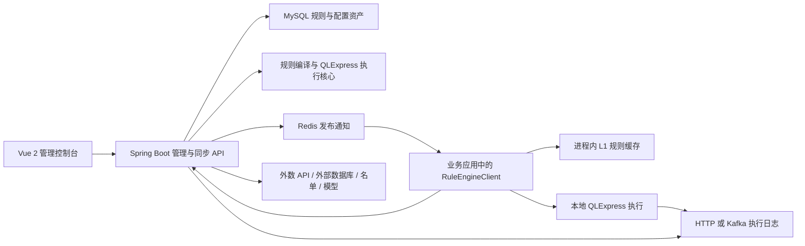
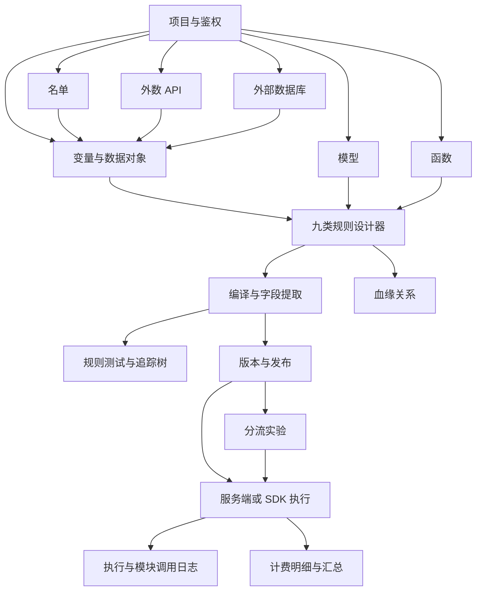

# 天枢决策引擎当前实现研究报告

> 研究基线：2026-07-17，Git `master` / `e5a8984`。  
> 本报告以仓库实际代码、数据库结构、自动化测试、构建结果和本地运行条件为证据；“未来方向”由当前实现独立推导，不引用仓库已有规划。README 仅描述产品能力和使用方式，本报告单独记录问题与改进建议。

## 1. 执行摘要

天枢决策引擎已经形成一套较完整的可视化决策平台，而不只是 QLExpress 的图形化包装。系统由管理控制台、规则管理服务、编译执行核心、业务 SDK、MySQL 和 Redis 组成，覆盖项目与鉴权、变量与数据对象、名单、外数 API、外部数据库、模型、函数、九类规则设计器、规则测试、血缘、实验、执行日志和计费等主要环节。

本次代码研究确认：

- 九种模型均有独立前端设计器和编译入口，规则可以经历设计、编译、测试、发布、同步、执行、追踪、版本和下线的完整生命周期。
- 规则、变量、模型、函数、外数、数据库、名单、实验、日志与计费并非孤立页面，后端已通过变量来源解析、模型/函数调用、发布快照、Redis 推送和执行追踪连接为一条业务链路。
- 工程基线健康：前端 85 个测试套件、954 个用例全部通过；后端 529 个用例全部通过；前端 lint、生产构建和 Maven 安装均成功。
- 当前最重要的技术风险集中在引用一致性、缓存生命周期、模型格式口径、错误可见性和生产安全配置五个方面。
- 本轮未修改业务代码。所有问题仅作为研究结论记录，便于后续分批确认和修复。

综合判断：项目处于“核心闭环已建立、正在补齐生产级一致性与运维治理”的阶段。业务功能覆盖面已经较宽，下一阶段的价值不在继续堆叠孤立菜单，而在强化引用契约、执行确定性、可观测性、资源治理和多人协作能力。

## 2. 研究范围、方法与证据

### 2.1 研究范围

本次覆盖：

- Maven 多模块结构和 Vue 2 前端结构；
- 39 张数据库表、20 个后端 Controller、37 个前端路由；
- 九类模型编译器、QLExpress 执行、规则发布和客户端同步；
- 变量、名单、外数 API、数据库、模型和函数的运行时调用；
- 规则测试、追踪树、执行日志、血缘、实验和计费；
- 前端布局、菜单、API 封装、页面交互和现有截图；
- 前后端构建、测试、lint 与本地服务启动条件。

### 2.2 方法

1. 从根 `pom.xml`、前端 `package.json`、路由和布局确认系统边界。
2. 从 Controller、Service、Mapper、实体和 `schema.sql` 反向梳理功能实现。
3. 从九类编译器、`VarContext`、发布服务和 SDK 追踪设计态到运行态的数据流。
4. 从 Vue 页面、API 模块、Mixin 和 `TraceTree` 还原业务操作路径。
5. 运行前端 lint、测试、生产构建，以及后端测试和 Maven 安装。
6. 对关键发现执行交叉检索，区分“已确认问题”“架构限制”“待运行验证风险”。

### 2.3 证据强度

| 等级 | 含义 |
|---|---|
| 已验证 | 已由自动化命令或实际运行输出验证 |
| 已确认 | 代码路径明确，能够从输入、分支和结果静态证明 |
| 待验证 | 代码显示存在风险，但需要真实数据、压力或外部依赖才能确认影响 |
| 建议 | 产品或工程演进方向，不代表当前缺陷 |

## 3. 产品定位与功能全景

系统可以抽象为六层：

| 层级 | 当前能力 | 主要实现 |
|---|---|---|
| 租户与入口 | 项目、控制台登录、项目访问凭证、Token 和访问审计 | `RuleProjectController`、`ProjectAuthController`、`ProjectAuthTokenController` |
| 数据与资源 | 变量、数据对象、名单、外数 API、外部数据库、模型、函数 | 对应 Controller/Service 和变量来源解析器 |
| 决策建模 | 决策表、决策树、决策流、规则集、交叉表、评分卡、复杂交叉表、复杂评分卡、QL 脚本 | `views/designer/*` 与九类 `RuleCompiler` |
| 生命周期 | 保存、字段刷新、编译、测试、发布、版本、对比、回滚、下线 | `RuleDefinitionController`、`RuleCompileService`、`RulePublishService` |
| 运行交付 | Server 执行、SDK 同步、L1 缓存、Redis 推送、HTTP/Kafka 日志上报 | `RuleSyncController`、`rule-engine-client` |
| 治理反馈 | 追踪树、执行日志、调用日志、血缘、实验、计费 | `TraceTree.vue`、日志/血缘/实验/计费模块 |

产品形态更接近“决策资产管理与执行平台”：设计器只是入口，真正的核心是资源引用、编译产物、发布版本和可追踪执行之间的闭环。

## 4. 系统架构与运行链路

### 4.1 设计态

前端设计器将模型保存为 `modelJson`。变量引用由 `_varId`、引用类型和展示字段组成；后端刷新输入/输出字段并交给对应编译器生成 QLExpress 脚本。结构化模型与脚本模型最终收敛为统一的编译和执行接口。

### 4.2 发布态

`RulePublishService` 在发布前检查规则调用环路，必要时重新编译；随后生成版本快照，更新 `rule_published`，修改规则发布状态，并向 Redis 推送包含规则编码、版本、模型类型、编译脚本和输出字段的消息。该过程把可编辑资产转换为可同步的运行资产。

### 4.3 运行态

- 只依赖入参、常量、计算变量和已同步函数的规则可在 SDK 进程内执行。
- 依赖 API、数据库、名单等服务端资源的规则走服务端执行，由 `VariableSourceResolver` 解析变量来源。
- SDK 启动时全量同步，缓存未命中时单条拉取，同时订阅 Redis 变更，并以定时全量同步兜底。
- 执行结果通过服务端日志或客户端日志上报进入执行日志；外数、数据库、名单和模型还保留各自的调用明细。

### 4.4 关键架构判断

- 优点：管理面和运行面分离；业务应用不直连规则数据库；规则发布后可以低延迟本地执行。
- 代价：存在“设计态 JSON—编译脚本—发布快照—客户端缓存”多份状态，必须严格管理引用标识和版本一致性。
- 边界：服务端资源变量无法在纯本地 SDK 中等价执行，调用方需要显式选择服务端执行。

## 5. 核心规则模型与代码实现

| 模型 | 编译器 | 设计与执行特点 |
|---|---|---|
| 决策表 | `DecisionTableCompiler` | 条件树与动作列，支持 FIRST、ALL、UNIQUE 命中策略 |
| 决策树 | `DecisionTreeCompiler` | 节点和边条件形成路径，任务节点产出动作 |
| 决策流 | `DecisionFlowCompiler` | 流程、网关、连线和任务节点，包含图环检查辅助逻辑 |
| 规则集 | `RuleSetCompiler` | 多条规则按顺序和命中策略执行 |
| 交叉表 | `CrossTableCompiler` | 行列二维命中并返回单元格结果 |
| 评分卡 | `ScorecardCompiler` | 评分项、权重、分段和等级输出 |
| 复杂交叉表 | `AdvancedCrossTableCompiler` | 多维条件组合与结果矩阵 |
| 复杂评分卡 | `AdvancedScorecardCompiler` | 维度组、维度规则、权重和等级 |
| QL 脚本 | `ScriptPassthroughCompiler` | 脚本透传，同时维护脚本变量引用 |

公共编译层由 `RuleCompiler`、`CompileResult`、`VarContext`、`ConditionCompiler` 和 `ActionDataCompiler` 组成。`VarContext` 负责把设计器中的资源引用解析为脚本实际名称；这也是当前一致性风险最集中的位置。

QLExpress 执行层统一接收编译脚本和上下文，支持内置聚合函数 `sum/count/max/min/avg`。规则调用、模型调用和外部变量解析在运行时共同写入追踪结构，为回溯树提供数据。

## 6. 功能模块及关联关系

### 6.1 变量是资源层与规则层的连接点

输入、常量和计算变量直接进入执行上下文；API、数据库和名单变量把外部能力包装为统一变量。数据对象字段、模型输出也可以成为设计器可选择的引用。变量 ID 和 `ref_type` 因而是系统最重要的数据契约。

### 6.2 模型和函数扩展决策表达力

模型提供结构化输入输出和调用日志；函数支持 QLExpress、Java 类和 Spring Bean。规则发布时会拼接项目函数前缀，使 SDK 获得可执行的完整脚本。

### 6.3 日志、追踪、血缘和计费是不同视角

- 追踪树回答“本次为何得到这个结果”。
- 执行日志回答“何时、由谁、以什么输入执行，结果和耗时是什么”。
- 血缘回答“某项资产被谁依赖、依赖谁”。
- 计费回答“哪些执行或外部调用形成了多少费用”。

这些模块共享同一执行链路，但生命周期不同：追踪是单次执行上下文，日志是持久记录，血缘偏静态资产关系，计费是执行事件的聚合投影。

## 7. 前端 UI 与业务操作路径

前端采用 Vue 2、Element UI、Vue Router、Monaco Editor 和 LogicFlow。控制台有 13 个一级菜单，覆盖项目、规则、变量、名单、外数、数据库、模型、函数、测试、血缘、实验、日志和账单；37 个路由还包含各类详情、设计器和辅助页面。

### 7.1 主路径

典型业务人员路径为：

1. 创建项目并配置访问凭证；
2. 建立变量、名单、外数/数据库连接、模型和函数；
3. 在九类设计器之一编排规则；
4. 保存并编译，使用设计器测试或规则测试核对输入输出；
5. 在“表达式追踪树”查看命中、未命中、节点耗时、嵌套规则和模块调用；
6. 发布规则，由业务系统通过 SDK 或服务端接口执行；
7. 在执行日志、血缘、实验和账单中持续观察与治理。

### 7.2 UI 设计现状

优点：

- 菜单按业务资源分组，资源管理、规则设计和运行治理入口明确。
- 九个设计器保留模型专属交互，同时共用变量选择、测试和保存能力。
- Monaco 适合 JSON、SQL 和 QL 脚本的长文本维护；LogicFlow 适合树和流的图形编排。
- 追踪组件不仅展示普通条件，还覆盖规则帧、嵌套规则、模型调用和多类规则命中结构。

需要持续优化的体验：

- 资源较多时，跨页面创建和回到设计器的上下文切换成本较高。
- 页面级加载错误的反馈策略不统一，部分列表失败后看起来像“没有数据”。
- 复杂设计器、Monaco 和 LogicFlow 形成较大的前端分包，需要改善首次加载反馈和按需加载。
- 血缘与追踪目前是两个独立入口，可进一步互相跳转，把“静态依赖”和“本次执行”串联起来。

## 8. 构建、测试与运行验证

### 8.1 已完成验证

| 验证项 | 结果 | 关键数据 |
|---|---|---|
| 前端 lint | 通过 | `npm.cmd run lint`，0 error |
| 前端单元测试 | 通过 | 85 suites，954 tests，0 failed |
| 前端生产构建 | 通过，有体积告警 | 主包约 1.22 MiB，树/流设计器约 1.02 MiB，Monaco worker 体积较大 |
| 后端测试 | 通过 | core 163、server 342、client 24，共 529 tests |
| Maven 安装 | 通过 | `mvn clean install -DskipTests`，5 个业务模块与父工程全部成功 |

运行环境为 JDK 8、Maven 3.9.16、Node 26.4.0、npm 11.17.0。仓库建议 Node 14+，本次较新 Node 版本仍完成了测试和生产构建。

### 8.2 实际运行与 UI 验证

在 MySQL、Redis 等依赖可用后，本轮实际启动了 `rule-engine-server` 和前端开发服务，并完全通过控制台界面执行了以下流程：

1. 使用管理员账号登录控制台；
2. 进入“规则测试”，选择已发布的 `[全局] 基础准入 (JCZR)`；
3. 页面正确加载 `RULE_SET` 模型、v14 发布版本和默认测试参数；
4. 点击“执行测试”，服务端返回成功，页面显示耗时 618 ms；
5. 响应结果为 `result=1`、`amount=0`、`period=0`；
6. “表达式追踪树”正确展示整体执行、模型调用 `score_f1`（425 ms）、规则集逐条判断及命中 `R0002 规则2` 的回溯路径。

本次操作没有通过直接写数据库跳过业务步骤。新的规则回溯追踪树截图已保存为 `docs/project-usage/project-usage-05-rule-trace-tree.png`，并已加入 README。

## 9. 已确认问题与待验证风险

### 9.1 P1：默认安全配置不适合直接用于生产

状态：已确认。

证据：`rule-engine-server/src/main/resources/application.yml:19-20` 提供 root 数据库账号与公开默认密码；`:45` 为项目凭证加密主密钥提供固定回退值；`:68-70` 提供 admin 默认口令且使用明文编码。

影响：如果部署时未覆盖环境变量，控制台、数据库和项目长期凭证存在可预测或可解密风险。README 已提示生产配置独立主密钥，但代码的默认回退仍使误部署成为可能。

建议：生产配置采用“缺少即拒绝启动”，开发默认值迁移到显式 dev profile；控制台密码使用强哈希；启动日志只报告配置是否安全，不输出密钥。

### 9.2 P1：变量引用契约存在编码/标签回退

状态：已确认。

证据：

- `rule-engine-builder-ui/src/mixins/varPickerMixin.js:492-535` 在 `_varId` 和 `varCode` 未匹配时，会用唯一 `varLabel` 回溯并改写引用。
- `rule-engine-core/src/main/java/com/hengshucredit/rule/core/compiler/VarContext.java:192-208` 在 ID 未解析时继续按 `varCode` 解析，最后直接返回原编码。
- `rule-engine-server/src/main/java/com/hengshucredit/rule/server/service/RuleCompileService.java:72-74` 和 `RuleVariableService.java:251-284` 构造了编码回退映射。

影响：变量编码和标签都允许由业务人员修改，旧模型中缺失或失效的 ID 可能被静默连接到同名资源，或以原始编码继续编译，造成“能保存/能编译但引用对象已变化”的隐蔽错误。这与系统数据库层以 ID 建立资产关联的原则不一致。

建议：先提供旧数据扫描和迁移报告，再把新保存和新编译改为 ID 强校验；兼容回退只允许在一次性迁移工具中出现，并记录迁移前后对象。

### 9.3 P2：外数响应缓存缺少容量和过期淘汰

状态：已确认。

证据：`ExternalApiInvokeService.java:71-72` 使用单例 `ConcurrentHashMap` 保存 Token 和响应缓存；`:100-123` 按 API ID 与完整参数形成高基数键并写入响应；代码中没有响应缓存的 `remove`、定时清理、最大容量或关闭清理逻辑。

影响：过期条目虽然不会再命中，但仍驻留内存。启用缓存的接口如果参数组合持续变化，服务进程内存会随历史请求增长。

建议：使用有最大容量、TTL 和指标的缓存实现；缓存键对敏感参数做摘要，不在内存键中保留完整业务值；增加唯一键数量和逐出次数监控。

### 9.4 P2：模型格式的前端承诺与后端能力不一致

状态：已确认。

证据：

- `ModelList.vue:45-48,150-153` 展示并接受 PMML、PICKLE、DILL、ONNX，上传框接受 `.dill`。
- `RuleModelService.java:624-632` 能识别 PMML、ONNX、TensorFlow `.pb`、PICKLE 和 LightGBM `.txt`，但没有 DILL；未知扩展名回退为 PMML。
- `RuleModelService.java:203-227,896-905` 只有 PMML 和 ONNX 具备解析/在线执行分支，其他格式仅能存储；不支持提示仍写“仅 PMML”，与 ONNX 分支不一致。

影响：DILL 文件会被按 PMML 解析并可能直接导入失败；PICKLE 等格式虽然可以保存，但不能在当前服务中执行，用户可能从列表文案误判为可预测模型。

建议：建立唯一的后端能力清单并由前端读取；区分“允许存档/上传”“可解析字段”“可在线执行”“可预加载”四种能力；未知扩展名应明确拒绝而不是回退 PMML。

### 9.5 P2：规则测试页会静默吞掉多类加载失败

状态：已确认。

证据：`RuleTest.vue:221-315` 的规则、项目、变量、函数和模型加载存在多个空 `catch`；`:405-617` 的枚举选项、模型内容、数据对象和资源候选加载也有静默忽略分支。最终执行异常本身会显示，但执行前的依赖数据失败不总是可见。

影响：网络、权限或服务端错误可能表现为空列表、空映射或缺少输入项，业务人员容易将系统故障理解为“项目没有规则/规则没有变量”。

建议：区分可降级的兼容读取和不可忽略的主数据加载；页面顶部统一展示失败模块、重试入口和 request ID；仅对确有替代路径的分支静默降级，并记录调试日志。

### 9.6 P3：前端包体较大

状态：已验证。

生产构建显示主入口、vendor、决策树和决策流分包均超过推荐阈值，Monaco worker、编辑器主体和字体资源尤为显著。功能不受影响，但在内网弱带宽或首次访问时会增加白屏和交互等待。

建议：确认路由级懒加载覆盖范围；Monaco 只装载实际语言和 worker；树/流共享依赖抽包；字体按字形子集化；以首屏可交互时间而非单纯包体作为验收指标。

### 9.7 P3：测试输出存在可消除的 Vue 警告

状态：已验证。

前端测试全部通过，但非静默运行会输出未注册 `loading` 指令等 Vue warning。它不代表生产页面故障，却会稀释真正的测试告警。

建议：在测试 setup 中补齐指令 stub，并让 CI 对新增 `console.error`/Vue warning 失败。

### 9.8 架构限制与待验证风险

| 项目 | 类型 | 判断 |
|---|---|---|
| 数据库只读保护 | 待强化 | 后端限制 SELECT、分号、锁语句、行数和超时，但仍应依赖数据库只读账号作为最终边界 |
| 规则编码全局唯一 | 架构限制 | `rule_definition`/`rule_published` 按规则编码唯一和查询，简化 SDK 调用，但限制多项目使用相同业务编码 |
| 动态脚本血缘 | 固有边界 | 结构化引用可以准确追踪，运行时拼接或高度动态脚本无法仅靠静态分析完整恢复 |
| 高并发发布/回滚 | 待验证 | 需要并发和故障注入验证版本号、发布表与 Redis 消息之间的一致性 |
| 外部调用韧性 | 待验证 | 已有超时、重试、缓存和日志，仍需以真实供应商延迟、限流和异常结构验证 |

## 10. 需要完善的能力

### 10.1 数据与引用治理

- 建立资产引用完整性扫描：缺失 ID、错误 `ref_type`、孤儿字段、重复编码、发布快照与设计态差异。
- 保存时校验，发布前强校验，迁移时输出可审计报告。
- 为变量、模型、函数、规则调用提供统一的引用选择器和引用详情侧栏。

### 10.2 运行可靠性

- 对缓存、线程池、外部连接池、规则执行队列增加容量边界和指标。
- 为发布、回滚、同步建立幂等号、状态机和可重放事件。
- 对外数、数据库、模型调用加入统一的超时预算、熔断、限流和降级策略。

### 10.3 可观测性

- 统一 trace ID、执行 ID、实验 ID、鉴权 ID 和账单明细 ID 的跳转关系。
- 从追踪树节点直接打开对应规则版本、变量来源、模型调用或外数日志。
- 增加规则命中率、P95/P99 耗时、失败率、缓存命中率和外部供应商质量看板。

### 10.4 规则工程化

- 增加规则样例集、回归集和批量对比，发布前自动对比当前版本与候选版本。
- 增加草稿锁、冲突提示、变更审阅和审批记录，支持多人安全协作。
- 对模型 JSON 建立显式 schema version 和迁移器，避免兼容逻辑散落在设计器与编译器。

### 10.5 前端体验

- 统一加载、空状态、错误状态和重试模式。
- 为复杂设计器增加缩略图、节点搜索、引用定位和未配置项检查。
- 对规则测试提供固定测试用例收藏、批量执行、结果 diff 和追踪树筛选。

## 11. 独立推导的未来方向

以下方向只从当前能力与约束推导，不参考仓库既有规划。

### 11.1 决策资产 CI/CD

把规则、变量、模型、函数和测试集视为可发布资产包：变更触发静态校验、引用检查、回归测试、审批和分环境推广。这样可以把当前控制台中的人工发布闭环升级为可审计交付流水线。

### 11.2 影子执行与结果对比

利用现有实验、服务端执行和追踪能力，让候选版本在不影响正式结果的情况下接收真实流量，自动比较输出、命中路径、耗时和外部调用差异。它比单纯比例分流更适合规则上线前验证。

### 11.3 统一决策解释层

在现有追踪树之上生成面向业务、审核和客服的解释摘要：输入事实、关键命中条件、使用的数据源、模型分数、最终动作、规则版本和责任人。解释必须来自结构化追踪，不能由自由文本推测。

### 11.4 时态血缘与影响分析

把当前静态血缘扩展为“某一版本、某一时间点”的资产图。修改变量或函数前，可计算受影响规则、已发布项目、近 30 天调用量和账单规模，并生成回归测试范围。

### 11.5 多运行时与隔离执行

当模型和脚本类型继续增加时，将模型执行和高风险自定义函数从管理服务中隔离为受限运行时；按项目设置 CPU、内存、超时和并发额度，避免单个模型或函数影响整个控制面。

### 11.6 决策质量闭环

在执行日志和实验之上接入延迟标签或业务结果，形成规则命中—业务结果—成本的闭环评估。系统由“执行正确”进一步演进到“决策有效”，但标签接入、指标定义和隐私边界需要独立设计。

## 12. 建议实施顺序与验收标准

| 顺序 | 主题 | 验收标准 |
|---|---|---|
| 1 | 生产安全基线 | 非 dev 环境缺少独立主密钥或安全控制台凭证时拒绝启动；敏感配置无公开回退值 |
| 2 | 引用完整性 | 新保存模型 100% 使用 ID + `ref_type`；历史数据扫描可输出定位与迁移结果；发布前拒绝悬空引用 |
| 3 | 外数缓存治理 | 有最大容量、TTL、逐出和指标；高基数压力测试中内存保持上界 |
| 4 | 模型能力口径 | 前后端共用能力清单；每种格式明确上传、解析、执行状态；未知格式明确拒绝 |
| 5 | 测试页错误反馈 | 任一关键依赖加载失败均有可见提示、重试和 request ID，不能表现为无数据 |
| 6 | 回归与影子执行 | 候选规则可用固定样例和历史流量对比输出、路径、耗时与外部调用 |
| 7 | 可观测与影响分析 | 从一次执行可跳转到所有关联日志和版本；从资产变更可得到调用量与受影响规则 |

每一项应先补可失败的测试或可量化基线，再修改实现；涉及 UI 的变更需要从控制台按真实步骤操作，不以直接写数据库替代业务流程。

## 13. 结论

天枢决策引擎的功能骨架和运行闭环已经成立：资源管理、九类建模、编译发布、SDK 交付、追踪日志、实验血缘和计费都能在代码中找到相互连接的实现。当前最需要解决的不是功能数量，而是让这些能力在生产环境中“引用不会漂移、状态能够一致、资源有明确上界、失败对用户可见、决策可以解释和回归”。

建议以安全与引用一致性为第一优先级，以缓存和错误可见性为第二优先级，再建设规则资产 CI/CD、影子执行和时态影响分析。这样能够在保留现有功能广度的同时，显著提高规则变更的可控性和运行可信度。
