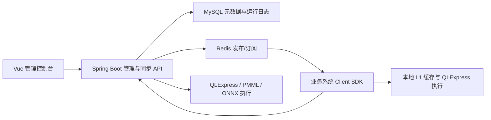
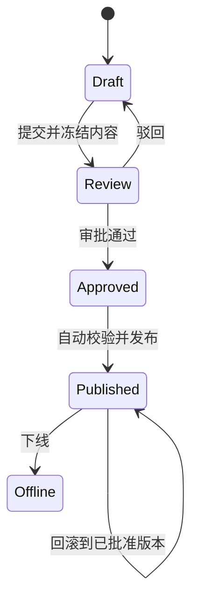

# 天枢决策引擎生产就绪复盘与后续规划

> 复盘日期：2026-07-22  
> 复盘基线：当前工作区实际代码、构建结果、自动化测试结果和可启动性验证  
> 目标运行时：JDK 17；Node.js 20.19 及以上且不设置最高版本  
> 说明：本报告的产品和技术判断由代码、数据库脚本、路由、控制器、服务、编译器和测试反向归纳，不以既有说明文档作为功能真实性依据。

## 1. 结论摘要

天枢已经形成一套覆盖“资源配置—规则编排—测试—发布—在线执行—追踪—实验—计费”的决策平台，而不是单一表达式执行器。九类设计器、变量取数、外数、数据库、名单、PMML/ONNX 模型、函数、版本、实验、血缘、执行日志和客户端 SDK 均能在代码中找到完整或基本完整的前后端实现。

当前代码可以作为**生产候选版本**继续打磨，但还不能仅凭本次测试结论直接宣布无条件生产交付。结论分为三层：

- **已达到**：JDK 17 全模块构建；Node 26 前端安装、Lint、1276 个单测、Vite 8 生产构建和 Playwright `dist` 烟测；PMML/ONNX 新版执行链；关键配置去默认密码；CORS 白名单；JPMML AGPL 开源交付材料；前端依赖审计 0 漏洞。
- **本次已修复**：Node 最低/最高版本门禁、Vite/Vitest/ESLint 工具链、LogicFlow 间接 `uuid` 漏洞、JPMML 1.7 API 兼容、PMML 缓存失效与并发容量、字段名被隐式转换、模型载荷 INFO 日志、Tomcat NIO 回环管道启动失败、宽松 CORS、共享默认密码、初始化脚本管理 root 账号等问题。
- **上线前仍须关闭**：真实部署环境端到端验收、AGPL Corresponding Source 发布入口、密钥托管与轮换、性能/容量/灾备演练、生产级权限与审计策略。

建议将当前状态定义为：**RC（Release Candidate），完成 P0 门禁后进入受控试生产，不建议直接全量生产。**

## 2. 复盘范围与方法

本次检查覆盖：

1. Maven 多模块结构、依赖管理、Java 版本约束与模型执行器。
2. Spring Boot 配置、控制器、服务、鉴权、CORS、数据库初始化和容器编排。
3. Vue 路由、布局、业务页面、九类设计器、API 层、公共组件和构建产物。
4. PMML、ONNX CPU/CUDA、图片/人脸模型等模型执行路径。
5. Maven/Vitest 测试、ESLint、Vite 生产构建、Playwright 烟测和服务启动过程。
6. 生产交付所需的安全、可观测性、发布、回滚、容量和合规门禁。

采用的证据优先级为：实际执行结果 > 测试代码 > 业务实现 > 配置和数据库脚本 > 文档描述。

## 3. 产品结构复盘

### 3.1 产品边界

系统可分为四层：

- **控制面**：项目、变量、规则、模型、函数、数据源、实验、版本和鉴权配置。
- **执行面**：服务端测试/执行、SDK 本地缓存执行、外数/数据库/名单取数、PMML/ONNX 推理。
- **治理面**：版本对比与回滚、血缘、执行追踪、调用日志和账单。
- **集成面**：HTTP 同步、Redis 推送、可选 Kafka 日志上报、Java Client SDK。

这种拆分方向正确：业务系统不直接读取规则库，管理端与运行端之间通过已发布规则和同步协议隔离，规则发布事件通过 Redis 触发缓存更新。

### 3.2 模块职责

| 模块 | 实际职责 | 评价 |
|---|---|---|
| `rule-engine-model` | 公共实体、DTO、枚举 | 边界清晰 |
| `rule-engine-core` | 九类规则编译、QLExpress 执行、PMML/ONNX 执行 | 核心能力集中，模型执行缓存已有测试保障 |
| `rule-engine-server` | 管理 API、同步 API、业务服务、数据访问、鉴权与日志 | 功能完整，但部分服务类过大 |
| `rule-engine-client` | 规则同步、L1 缓存、本地执行、日志上报 | 适合作为在线业务接入层 |
| `rule-engine-example` | SDK 接入示例 | 可作为集成烟测入口继续加强 |
| `rule-engine-builder-ui` | Vue 3 管理控制台和九类设计器 | 产品覆盖完整，但部分 SFC 体积过大 |
| MySQL/Redis 编排 | 元数据、初始化、发布订阅 | 已移除仓库内共享密码，仍需生产密钥系统承接 |

### 3.3 功能覆盖

从前端视图、API、控制器和服务的对应关系看，当前已实现：

- 项目管理、访问凭证与 SDK 接口说明。
- 九类规则：决策表、决策树、决策流、规则集、交叉表、评分卡、复杂交叉表、复杂评分卡、QL 脚本。
- 输入/计算/常量/API/数据库/名单变量，以及相应在线测试。
- 名单库、记录导入导出、匹配与日志。
- 外数数据源、接口、鉴权、请求/响应映射、预览与调用日志。
- 外部数据库连接、查询测试、调用日志。
- PMML、ONNX、图片与人脸模型管理、测试和调用日志。
- QLExpress、Java 类、Spring Bean 函数。
- 规则测试、追踪树、版本对比/回滚、血缘、冠军/挑战/测试组实验。
- 服务端与客户端执行日志、计费项、明细和汇总。

因此，后续规划不应再把外数、数据库、账单、实验或版本回滚当作“从零新增”功能，而应转向生产治理、可操作性和规模化能力。

## 4. 功能与交互设计评价

### 4.1 优点

- 九类设计器按模型语义拆分，避免以一个通用画布承载所有规则形态。
- 变量选择、动作配置、测试弹窗、JSON/SQL/脚本编辑器形成了相对统一的业务操作语言。
- 规则测试不仅返回结果，还保留输入、追踪与错误信息，符合风控规则排查需求。
- 版本、实验、日志和账单围绕发布规则形成闭环，而不是彼此孤立的工具页。
- 变量、模型和规则引用已明确以 ID 为关联依据，输出字段通过 `ref_type` 区分类型，降低改名导致引用断裂的风险。
- ONNX 的 CPU/CUDA 配置、失败回退、预加载和会话缓存已覆盖生产中常见的异构运行场景。

### 4.2 设计缺口

1. **发布治理不足**：已有版本和回滚，但缺少显式的草稿、复核、批准、发布、下线状态机及职责分离。
2. **环境晋级不足**：缺少“开发—测试—预发—生产”的不可变制品晋级、差异比较和审批记录。
3. **权限模型不足**：控制台登录更接近单一管理入口，生产通常还需要项目/资源/操作级 RBAC、最小权限和高风险操作二次确认。
4. **模型契约不足**：PMML/ONNX 支持执行，但需要进一步固化模型文件摘要、输入输出 Schema、运行时版本、签名、兼容性和回滚策略。
5. **可解释性边界**：结构化规则可追踪，脚本动态引用的血缘只能静态尽力识别，应在 UI 中明确“已确认/推断/未知”三种可信等级。
6. **运营视角不足**：日志与账单已有数据基础，但缺少面向生产值守的错误率、P95/P99、缓存命中率、外部依赖成功率、模型回退率和规则版本分布看板。

## 5. 代码结构与实现评价

### 5.1 可靠性基础

- Maven 父 POM 统一控制 Java、Spring Boot、QLExpress、JPMML 和 ONNX Runtime 版本。
- 每类规则由独立 `RuleCompiler` 实现，条件和动作又有公共编译单元，扩展边界合理。
- `VarContext` 使用变量 ID 映射脚本字段名，设计器也保存 `_varId`，避免以可变业务名称建立引用。
- PMML 和 ONNX 会话均采用缓存降低模型重复加载成本；ONNX 运行配置进入缓存键。
- 服务端、客户端和核心模块均有行为测试，前端页面与工具函数也有较大规模的组件测试。

### 5.2 可维护性问题

当前主要结构性债务是超大文件和职责聚合。实测较大的文件包括：

| 文件 | 约行数 | 风险 |
|---|---:|---|
| `TraceTree.vue` | 5334 | 展示、追踪计算、交互状态耦合，修改回归面过大 |
| `VariableList.vue` | 4889 | 多种变量来源的表单、测试、详情集中在单组件 |
| `ApiDetail.vue` | 3634 | 外数协议、鉴权、映射和 UI 状态耦合 |
| `RuleDetail.vue` | 3078 | 规则生命周期和多个子功能聚合 |
| `DecisionFlow.vue` / `DecisionTree.vue` | 约 2450 | 画布、数据转换、校验和持久化耦合 |
| `RuleFieldAnalyzer.java` | 2445 | 多模型字段解析职责过重 |
| `ExternalApiInvokeService.java` | 2197 | 协议构造、鉴权、调用和解析聚合 |

建议按业务能力拆分，而不是按“代码行数”机械拆分：例如变量页拆为来源配置表单、在线测试、详情抽屉和列表编排；外数调用拆为请求构造、鉴权签名、传输、响应提取与审计。拆分时先补契约测试，避免改变已有行为。

### 5.3 前端工程与 UI

前端已升级到 Vue 3.5.40、Element Plus 2.14.3、Vite 8.1.5、Vitest 4.1.10 与 ESLint 10.7.0，在 Node 26.4.0 下能够安装、Lint、测试和构建，说明“Node 不限制最高版本”的项目约束可以成立。

当前 UI 的主要问题不是风格不可用，而是加载体积和回归成本：

- 生产构建主入口约 822 KiB，LogicFlow 图设计器异步 chunk 约 2.43 MiB。
- 字体资源约 7.06 MiB，Monaco 相关 worker/editor 最大约 4.36 MiB。
- Vue CLI 5 与 Jest 27 已移除；Vitest 4 全量 120 个测试文件通过，ESLint 已迁移到 flat config。
- LogicFlow 当前上游仍声明 `uuid@^9`，项目用 npm override 固定为 `uuid@11.1.1`；相关单测、Vite 构建和 Playwright 页面导航均通过，生产与全依赖审计为 0 漏洞。
- Playwright `dist` 烟测可覆盖真实生产资源、菜单导航和浏览器异常，但不能替代连接真实 MySQL/Redis/后端的发布闭环。

下一步应针对 LogicFlow、Monaco 和字体继续做按需加载、字体子集化和性能预算；不要与超大组件领域拆分同时进行，以便独立衡量收益和回归面。

## 6. 本次发现并修复的问题

| 级别 | 问题 | 修复与校验 |
|---|---|---|
| P0 | 配置和编排包含共享默认密码/主密钥 | 改为环境变量必填，新增 `.env.example` 和配置契约测试 |
| P0 | 数据库初始化脚本管理 root 账号并授权 | 删除账号管理、`GRANT ALL` 和 `FLUSH PRIVILEGES`，测试禁止回归 |
| P1 | CORS 允许任意来源同时携带凭证 | 改为可配置白名单；可信来源通过、非可信来源返回 403 |
| P1 | JPMML 升级后服务代码仍调用旧 `FieldName#getValue()` | 适配 JPMML 1.7 字符串字段 API，全模块编译通过 |
| P1 | PMML 模型缓存键不含文件内容，替换同路径模型后可能继续执行旧模型 | 缓存键加入 SHA-256 内容摘要，并新增失效测试 |
| P1 | PMML LRU 缓存并发访问可能突破容量或破坏顺序 | 对缓存读写与淘汰进行同步并增加并发容量测试 |
| P1 | PMML 字段曾尝试驼峰/下划线别名，违背“原样保留” | 只接受模型声明的精确字段名，别名输入测试明确失败 |
| P1 | PMML 入参和输出在 INFO 级别记录，可能泄露业务数据 | 调整为 DEBUG，生产默认不输出模型载荷 |
| P2 | PMML 缓存容量可配置为零或负数 | 构造阶段拒绝非法容量并新增测试 |
| P1 | 受限 Windows 环境中 JDK `Selector` 无法建立回环管道，Tomcat NIO 启动失败 | 嵌入式 Tomcat 切换为 NIO2，并新增协议防回归测试和真实启动验证 |
| P1 | Vue CLI/Jest 旧工具链存在维护与供应链风险 | 迁移到 Vite 8、Vitest 4、ESLint 10 flat config，120 个测试文件全部通过 |
| P1 | LogicFlow 间接 `uuid@9` 命中安全公告 | npm override 到 `uuid@11.1.1`，审计 0 漏洞并完成 LogicFlow 测试、构建和浏览器烟测 |
| P2 | Node 检查脚本存在最高版本限制且最低版本不足以运行 Vite 8 | 只拒绝低于 20.19 的版本；不设上限，Node 26 完整前端校验通过 |

## 7. 依赖升级结论

### 7.1 JDK

- 父 POM 固定 Java 17，低于 17 的 Maven 构建会失败。
- 使用 JDK 17.0.19 完成 `mvn clean install -DskipTests` 和全量 `mvn test`。
- 未把 JDK 21/24 特性引入源码，保证交付运行时仍是 Java 17。

### 7.2 PMML

- 升级到 JPMML Evaluator 1.7.7，并使用推荐的 `pmml-evaluator-metro` 组合。
- JPMML 官方仓库说明 1.7.x 要求 Java 11 及以上，满足 JDK 17 目标；Central 当前工件为 1.7.7。[JPMML Evaluator](https://github.com/jpmml/jpmml-evaluator)、[Maven Central](https://central.sonatype.com/artifact/org.jpmml/pmml-evaluator)
- **许可方案已确定为 AGPL 开源交付**：仓库新增 `THIRD_PARTY_LICENSES.md`、AGPL 全文、NOTICE 和防回归契约。包含 JPMML 的制品或网络服务必须提供与运行版本一致的完整 Corresponding Source；若不能满足则不得交付，需另行取得商业授权或替换实现。

### 7.3 ONNX

- 保持 ONNX Runtime 1.26.0；复盘时它是官方发布与 Maven Central 中的当前稳定版本。[ONNX Runtime Releases](https://github.com/microsoft/onnxruntime/releases)、[Maven Central](https://central.sonatype.com/artifact/com.microsoft.onnxruntime/onnxruntime)
- Java 官方文档的 CPU/GPU 工件选择与当前 Maven Profile 方案一致。[ONNX Runtime Java](https://onnxruntime.ai/docs/get-started/with-java.html)
- 44 个针对性测试覆盖原生推理、会话缓存、CUDA 到 CPU 回退、预热、图片和人脸模型执行。

## 8. 验证结果

| 范围 | 命令/方式 | 结果 |
|---|---|---|
| 后端编译安装 | `mvn clean install -DskipTests`，JDK 17.0.19 | 六模块成功 |
| 后端全量测试 | `mvn test` | 共运行 740 个测试：739 通过，0 失败，0 错误，1 个 CUDA 环境测试跳过 |
| 前端 Lint | `npm run lint`，Node 26.4.0 | 通过 |
| 前端单元/组件测试 | `npm test` | 120 个测试文件、1276 个测试全部通过 |
| 前端生产构建 | `npm run build` | 成功；存在大体积资源警告 |
| 前端生产依赖审计 | `npm audit --omit=dev` | 0 漏洞；LogicFlow 间接依赖 override 为 `uuid@11.1.1` |
| 全依赖审计 | `npm audit` | 0 漏洞 |
| 后端启动 | JDK 17 执行 `mvn spring-boot:run` | `Http11Nio2Protocol` 正常启动，8080 持续监听，HTTP 根路径返回 200；验证完成后已主动停止进程 |
| 浏览器 E2E | Playwright 加载真实 `dist`、模拟 API | Chrome 下项目→规则→模型导航通过，页面异常和控制台错误为 0；真实后端联调仍需 `E2E_BASE_URL` |

原失败在 JDK 17、JDK 24 下均可由最小 `Selector.open()` 探针复现，根因是受限 Windows 环境无法为传统 NIO Selector 建立回环管道；同环境的 NIO2 异步监听探针正常。嵌入式 Tomcat 改用 NIO2 后，完整应用在现有本地 MySQL/Redis 实例上启动并通过 HTTP 200 验证。交付验收仍需在标准部署环境执行完整 UI 操作、容量和故障恢复验证。

## 9. 未关闭风险与优先级

### P0：发布阻断

1. **AGPL 发布执行**：在实际发布站点提供版本一致的 Corresponding Source 下载入口，并保留许可证、NOTICE 和重建材料。
2. **真实环境 E2E**：使用全新数据库、Redis、反向代理和 HTTPS，按 UI 完成登录、项目、变量、规则设计、测试、发布、SDK 同步执行、日志与回滚。
3. **密钥与凭证**：接入 Vault/KMS/容器 Secret；验证轮换、旧密钥迁移、备份恢复和泄露处置。
4. **容量与灾备**：完成规则执行、外数、模型、日志写入的压测；给出容量基线、SLO、备份、恢复时间和回滚演练记录。

### P1：试生产前完成

- 项目级 RBAC、操作审计、敏感字段脱敏、日志留存与删除策略。
- CI 门禁：JDK 17 构建、前后端测试、Lint、生产构建、依赖/许可证/镜像扫描。
- MySQL/Redis/Testcontainers 集成测试和 SDK 跨版本兼容测试。
- 外数出网域名/IP 白名单、SSRF 防护、超时/重试/熔断/限流的统一策略。
- 数据库数据源只读账号和 SQL 类型双重约束，不只依赖使用说明。
- Micrometer 指标、结构化日志、Trace ID、规则版本和模型设备标签。
- Monaco、LogicFlow、字体资源按需加载，制定首屏和交互性能预算。

### P2：规模化演进

- 拆分超大 Vue 组件和服务类，建立领域边界与契约测试。
- 增强动态脚本血缘、循环依赖检查和影响分析可信度。
- 多租户隔离、配额、成本归属、灰度/金丝雀、自动回滚。
- 模板市场、规则包复用、批量迁移和跨环境差异管理。

## 10. 后续开发路线图

### 阶段 0：关闭发布门禁（1—2 周）

目标：把当前候选版本变成可重复验收的交付物。

- 将已确定的 JPMML AGPL 开源方案接入发布站点，自动生成 Corresponding Source、SBOM 和许可证包。
- 建立 CI 流水线与 JDK 17/Node LTS、Node 最新版双矩阵校验。
- 在标准部署环境跑通全链路 E2E、性能基线、备份恢复和回滚演练。
- 固化 `.env`/Secret、HTTPS、CORS、Cookie、安全 Header 和数据库只读账号模板。
- 产出版本化部署包、数据库变更清单、配置清单、SBOM 和验收记录。

退出条件：所有 P0 项有可审计证据，关键链路 E2E 通过，故障回滚在目标 RTO 内完成。

### 阶段 1：生产治理基础（2—4 周）

目标：让规则变更可控、可追责、可观测。

- 引入项目/角色/资源/操作四级 RBAC。
- 建立规则生命周期：`DRAFT → REVIEW → APPROVED → PUBLISHED → OFFLINE`。
- 发布前自动运行样例、回归集、Schema 校验和依赖影响分析。
- 增加规则执行、外部依赖、缓存、PMML/ONNX 会话和 CUDA 回退指标。
- 为外数、数据库和模型调用统一超时、限流、熔断与错误分类。

退出条件：生产发布必须审批，关键指标可告警，每次决策可定位到项目、规则版本、模型摘要和调用链。

### 阶段 2：环境晋级与模型治理（4—8 周）

目标：减少人工复制和模型运行差异。

- 将规则、变量、函数、模型与依赖打包为不可变“决策制品”。
- 支持开发、测试、预发、生产环境晋级和差异比较，不在生产直接编辑制品。
- 建立模型注册表：文件摘要、格式、运行时、输入输出 Schema、签名、基准样例、设备要求和兼容范围。
- 支持影子执行、冠军/挑战统计检验、模型/规则漂移监控和一键回滚。
- 血缘结果增加确定性等级和发布影响报告。

退出条件：同一制品跨环境内容一致；模型替换前有自动兼容性与基准验证。

### 阶段 3：平台化与性能治理（6—10 周）

目标：支撑多团队、大规模规则和稳定运营。

- 多租户隔离、配额、成本中心、审计导出和留存策略。
- 规则/模型分层缓存、预热计划、热点识别和容量预测。
- 灰度发布、自动止损、跨实例版本一致性和灾备切换。
- 拆分超大前端组件与服务，优化 Vite 分包并实施资源性能预算。
- 建立规则模板、复用包、批量迁移和 OpenAPI/SDK 兼容策略。

退出条件：在目标峰值下满足 SLO；租户、发布、回滚、成本与审计流程可由平台自助完成。

## 11. 推荐的关键功能设计

### 11.1 受控发布流

设计要点：提交复核后内容不可变；发布产生唯一制品摘要；审批人不能等于最后修改人；回滚是发布一个旧制品的新事件，不能覆盖历史记录。

### 11.2 决策制品与环境晋级

一个制品至少包含规则版本、编译脚本、变量/函数/模型引用 ID 与版本、模型文件摘要、输入输出 Schema、依赖清单和回归样例摘要。晋级只复制制品和环境绑定配置，禁止按名称重新匹配资源。

### 11.3 决策可观测性

每次执行统一记录：`traceId`、项目、规则 ID/版本、制品摘要、实验分组、模型摘要/设备、外部依赖耗时、总耗时、结果状态和错误分类。输入输出按字段策略脱敏，不把原始载荷默认写入 INFO 日志。

### 11.4 模型运行契约

- PMML/ONNX 字段名精确匹配，不做隐式大小写或命名风格转换。
- 上传时计算摘要并校验格式、输入输出、样例和运行时兼容性。
- 缓存键包含内容摘要和运行配置；替换内容必然创建新会话。
- GPU 失败回退 CPU 必须产生指标和告警，不能静默长期降级。
- 模型删除、替换和下线前必须执行引用影响分析。

## 12. 生产验收清单

- [ ] JDK 17 构建、后端测试和启动通过。
- [x] Node 20.19+ 与当前较新 Node 版本通过安装、Lint、测试和 Vite 8 生产构建。
- [ ] HTTPS、反向代理、CORS、Cookie、安全 Header 和真实域名配置通过安全验收。
- [ ] MySQL/Redis/控制台/项目鉴权无共享默认密码，Secret 可轮换。
- [ ] 全新环境初始化与已有数据升级均有可回滚脚本和备份。
- [ ] 九类设计器从 UI 完成创建、校验、测试、发布、执行、追踪和回滚。
- [ ] API、数据库、名单、PMML、ONNX CPU/CUDA 的成功与失败路径均验证。
- [ ] SDK 全量同步、增量推送、断网恢复、缓存失效和版本兼容验证。
- [ ] 性能、稳定性、灾备、容量、日志留存和告警达到约定 SLO。
- [ ] SBOM、漏洞例外、JPMML 许可和第三方许可证完成审核。

## 13. 最终建议

下一步不宜继续横向堆叠功能。优先顺序应为：**关闭合规与安全门禁 → 建立真实 E2E/CI/容量证据 → 完成发布治理与可观测性 → 再做平台化和大型重构**。这样能够保留现有功能投入，同时把“功能可用”转化为“可稳定、可审计、可回滚地交付”。
